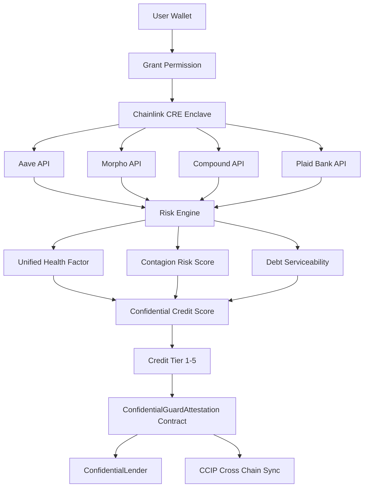

# Xypher Sovereign
### Confidential Credit Oracle for DeFi

[](https://soliditylang.org/)
[](https://hardhat.org/)
[](LICENSE)
[]()
[](https://chain.link/)
[](https://xypher.vercel.app)

> Confidential credit intelligence enabling undercollateralized lending across DeFi.
> 
> The first confidential credit intelligence layer that privately aggregates a borrower’s full financial profile across **DeFi protocols and traditional finance**, computes risk inside a **hardware-secured Trusted Execution Environment**, and publishes **verifiable on-chain credit attestations** enabling undercollateralized lending.

Built for **Chainlink Convergence Hackathon 2026**

---

# Table of Contents

- Overview
- Problem
- Solution
- Architecture
- Credit Tier System
- Risk Engine
- Smart Contracts
- Chainlink Services
- Demo Flow
- Repository Structure
- Security Model
- Integration Guide
- Local Development
- Test Suite
- Roadmap

---

# Overview

DeFi lending protocols today rely entirely on **overcollateralization**.

Users must deposit **150% or more collateral** to borrow assets.  
This system ignores real-world financial strength.

Institutions with billions in assets receive the same borrowing terms as anonymous wallets.

**Xypher Sovereign introduces confidential credit intelligence for DeFi.**

The protocol privately aggregates financial data across multiple sources and produces a **cryptographically verifiable credit tier** usable by lending protocols across blockchains.

Key properties:

- Private financial data aggregation
- Hardware-enforced computation
- Verifiable on-chain attestations
- Cross-chain credit portability
- Undercollateralized lending enablement

---

# System Architecture



# Problem

Three fundamental barriers prevent real credit markets in DeFi.

## Identity Gap

DeFi protocols cannot access off-chain financial data such as:

- bank balances
- income streams
- existing credit lines
- repayment history

All borrowers are treated as **high risk**.

---

## Privacy Barrier

Financial strength normally requires revealing:

- portfolio allocations
- collateral strategies
- bank account data

This information cannot be exposed publicly on blockchain networks.

---

## Fragmented Financial Data

Users hold positions across multiple platforms:

- Aave
- Morpho
- Compound
- centralized exchanges
- traditional banks

No system aggregates these exposures into a unified financial risk profile.

---

# Solution

Xypher Sovereign introduces a **Confidential Credit Oracle**.

Financial data is aggregated privately using **Chainlink Confidential Runtime Environment (CRE)**.

All analysis occurs inside a **hardware-secured Trusted Execution Environment (TEE)**.

Only a **credit tier** is published on-chain.

No raw financial data is ever exposed.

---

# Architecture

```
                ┌─────────────────────────────┐
                │   Chainlink CRE Enclave     │
                │                             │
   Aave API ────┤                             │
   Morpho API ──┼──► Risk Intelligence Engine │
   Compound ────┤                             │
   Plaid API ───┘                             │
                                              │
             Unified Health Factor            │
             Contagion Risk Score             │
             Debt Serviceability              │
                        │                     │
                        ▼                     │
                   Credit Tier                │
                └──────────────┬──────────────┘
                               │
                               ▼
        ConfidentialGuardAttestation.sol
                               │
              ┌────────────────┴───────────────┐
              ▼                                ▼
      ConfidentialLender                CCIP Broadcast
      Undercollateralized loans         Cross-chain credit
```

---

# Credit Tier System

Borrowers receive a **Confidential Credit Score (CCS)** mapped to a tier.

| Tier | Name | Max LTV | Borrower Profile |
|-----|------|---------|----------------|
| 1 | Sovereign | 90% | Institutional grade |
| 2 | Assured | 80% | Prime credit |
| 3 | Verified | 70% | Near prime |
| 4 | Building | 60% | Subprime |
| 5 | Restricted | Ineligible | High risk |

Example comparison:

| Protocol | Max LTV |
|---------|---------|
| Aave v3 | 66% |
| Xypher Tier 1 | **90%** |

This significantly improves **capital efficiency** for trusted borrowers.

---

# Risk Engine

All risk computation occurs inside the confidential enclave.

### Unified Health Factor

Aggregates positions across **multiple protocols simultaneously**.

Traditional DeFi health factors operate per-protocol.  
Xypher computes a **global health factor across the entire portfolio**.

---

### Contagion Risk Score

Simulates **market crash scenarios** from 5% to 50%.

Detects cascading liquidations across protocols before they occur.

---

### Debt Serviceability Score

Uses banking data (via Plaid) to evaluate:

- income stability
- debt obligations
- repayment capacity

This mirrors traditional bank credit assessment.

---

### Confidential Credit Score (CCS)

All risk metrics combine into a final **credit tier (1–5)**.

Only this tier is published on-chain.

No underlying financial data is revealed.

---

# Smart Contracts

### Ethereum Sepolia

| Contract | Purpose |
|--------|--------|
| ConfidentialGuardAttestation | Credit attestation registry |
| ConfidentialLender | Lending contract using credit tiers |
| GuardianVault | Position monitoring system |
| CreditIdentityNFT | Soulbound credit identity |
| CCIPGuardianReceiver | Cross-chain execution |
| CrossChainAttestationReceiver | Attestation synchronization |

---

# Chainlink Services Used

The protocol integrates multiple Chainlink services.

| Service | Purpose |
|------|------|
| CRE Confidential HTTP | Private API queries |
| CRE Confidential Compute | Secure risk computation |
| Data Feeds | Price oracle data |
| Automation | Continuous monitoring |
| CCIP | Cross-chain attestation sync |
| ACE | Compliance proof generation |

---

# Demo Flow

1. User connects wallet
2. Permission transaction granted
3. CRE enclave queries financial data
4. Risk engine computes credit score
5. Attestation minted on-chain
6. Borrower accesses lending protocol
7. CCIP syncs credit across chains
8. Automation monitors health factor

---

# Repository Structure

```
Xypher/
│
├── contracts/
│   ├── core/
│   ├── interfaces/
│   ├── libraries/
│   ├── scripts/
│   └── tests/
│
├── workflows/
│   └── credit-intelligence-engine/
│
└── frontend/
```

---

# Security Model

The protocol includes several protections.

- Attestation verification on every borrow
- Liquidation at health factor < 1
- Reentrancy protection
- Pausable emergency circuit breaker
- Immutable workflow address
- Auto-expiring credit attestations
- Hardware-secured computation

---

# Integration Guide

Protocols can integrate the credit oracle using the standard interface.

```solidity
IConfidentialGuard attestation = IConfidentialGuard(ATTESTATION_REGISTRY);

function borrow(uint256 amount) external {
    (bool valid, uint8 tier, ) = attestation.verifyAttestation(msg.sender, 4);
    require(valid, "Invalid credit attestation");

    uint256 ltv = tierMaxLTV[tier];

    // lending logic
}
```

This allows **any DeFi lending protocol** to support confidential credit-based lending.

---

# Local Development

### Requirements

- Node.js 20+
- Hardhat
- MetaMask
- Sepolia ETH

---

### Install Contracts

```bash
cd contracts
npm install
```

Run tests:

```bash
npx hardhat test
```

Deploy:

```bash
npx hardhat run scripts/deploy.ts --network sepolia
```

---

### Frontend

```bash
cd frontend
npm install
npm run dev
```

---

# Test Suite

The protocol includes a comprehensive test suite.

| Contract | Tests |
|--------|------|
| ConfidentialGuardAttestation | 107 |
| CCIPGuardianReceiver | 49 |
| ConfidentialLender | 34 |
| CreditIdentityNFT | 25 |
| CrossChainAttestationReceiver | 25 |
| GuardianVault | 22 |
| Libraries | 20 |
| **Total** | **257** |

All tests passing.

---

# Roadmap

Future development includes:

- mainnet deployment
- additional TradFi integrations
- zk-proof credit attestations
- institutional lending pools
- DAO governance model

---

# License

MIT License

---

Built for **Chainlink Convergence Hackathon 2026**
